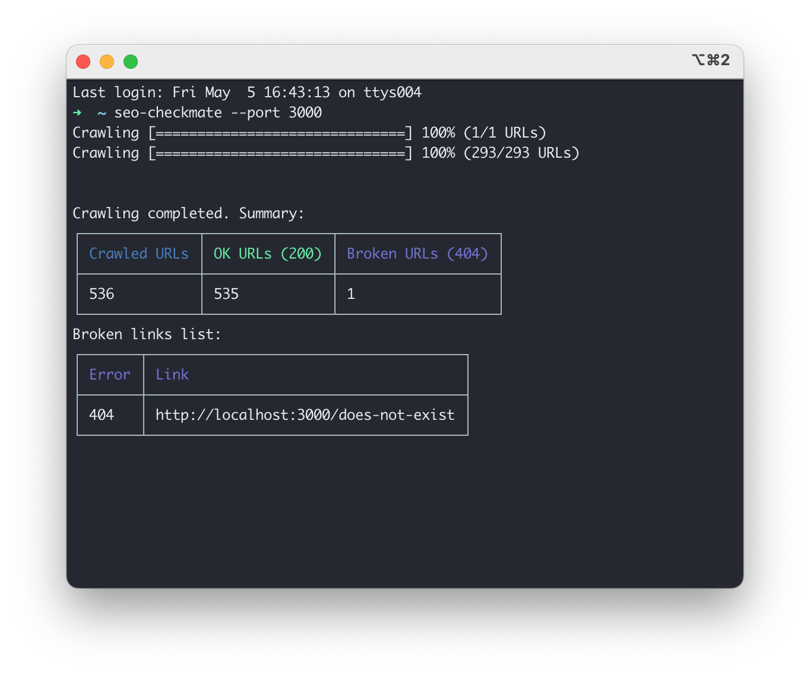

# SEO Checkmate


SEO Checkmate is a command-line tool that helps you find broken links on your website. It crawls your entire site and provides a summary of the total number of URLs, OK URLs, and broken URLs (404 errors). It also generates a list of broken links for you to review and fix.

## Features

- Crawls your entire website
- Supports crawling subdomains and external domains
- Customizable crawling restrictions
- Verbose output option for detailed information during the crawl
- Progress bar and summary table for easy overview
- Broken links list for easy identification and fixing

## Installation

Install SEO Checkmate globally using NPM:

```bash
npm install -g seo-checkmate
```

## Usage

To start crawling your website, simply run the `seo-checkmate` command followed by the `--site` or `-s` option and the URL of your website:

```bash
seo-checkmate --site https://example.com
```

### Options

| Option           | Alias | Description                  | Type      | Default                    |
| ---------------- | ----- | ---------------------------- | --------- | -------------------------- |
| `--site`         | `-s`  | The website to crawl         | `string`  | `localhost`                |
| `--port`         | `-p`  | Port for the localhost       | `number`  | `80`                       |
| `--restrictions` | `-r`  | Restrictions for the crawler | `string`  | `no-external,no-subdomain` |
| `--verbose`      | `-v`  | Enable verbose output        | `boolean` | `false`                    |

### Restrictions

Using the `--restrictions` or `-r` option, you can specify crawling restrictions for the tool to follow:

- `no-external`: Do not crawl external domains
- `no-subdomain`: Do not crawl subdomains

To use multiple restrictions, separate them with a comma:

```bash
seo-checkmate --site https://example.com --restrictions no-external,no-subdomain
```

### Verbose Output

Enable verbose output for more detailed information during the crawl using the `--verbose` or `-v` option:

```bash
seo-checkmate --site https://example.com --verbose
```

## Example

To crawl a website with the following settings:

- Website: `https://example.com`
- Crawl subdomains, but not external domains
- Enable verbose output

Use the following command:

```bash
seo-checkmate --site https://example.com --restrictions no-external --verbose
```

## Contributing

If you would like to contribute to the project, feel free to fork the repository and submit a pull request. If you find any issues, please report them in the GitHub issue tracker.

## License

SEO Checkmate is released under the [MIT License](https://opensource.org/licenses/MIT).
